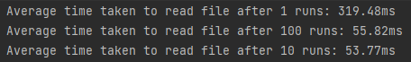
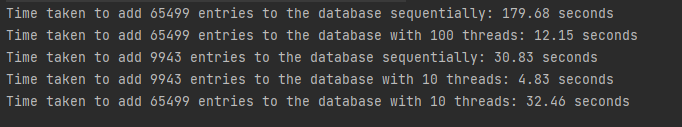

# SpartaGlobal_DataMigration

### What is the project about?
This is a project using Java to read a CSV file. It then adds the entries to a MySQL Database.
Multithreading is also used in this project in order to speed up the operation of adding to the database.
### Performance testing results

